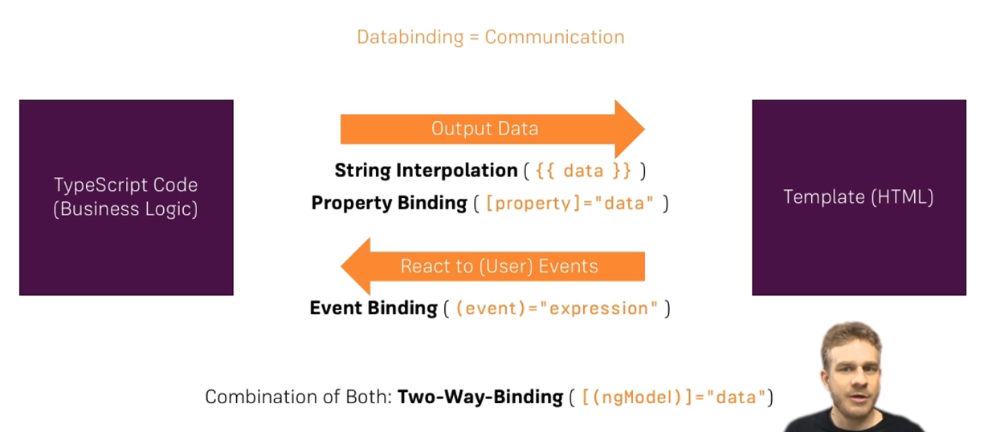

## Databinding
It is same as communication between Typescript code (Business Logic)  and Template(HTML).

### Output Data
Typescript Code to HTML 

### React to Event
Template to Typescript





### String Interpolation
Anything that can to converted into string 
Can Have method returns a string
```typescript
<h1>{{textValue}}</h1>
```
