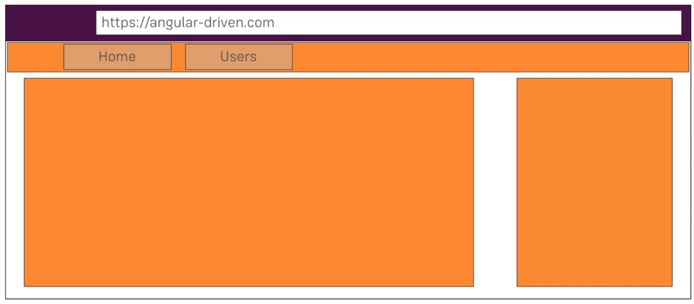

index html file is served by the server

Cli created root component

Selector 

Bundles

main.ts -> First code to execute
Bootstrap AppModule

app.module.ts
bootstrap:[AppComponent]


## Components are important



## Creating Components with CLI
```
ng generate component servers
```

### Template is must
```typescript
@Component({
  selector: "app-server",
  template: `<app-home></app-home>`,
})
```


